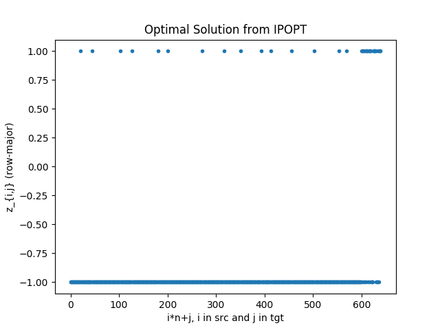
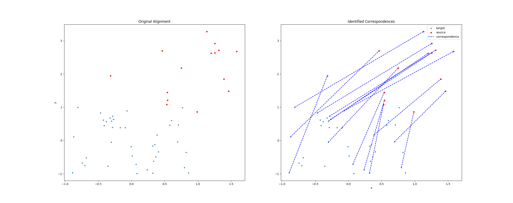
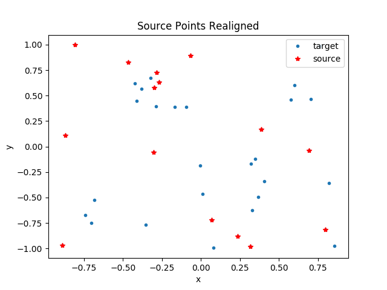

# point-registration-with-relaxation
binary optimization relaxation applied to the point set registration problem and related utility functions

## Brief Intro
### Correspondence Identification (Matching)
This repo addresses the issue of point cloud matching using a convex relaxation of a \[0, 1\] optimization problem.  For more information about the formulation of the problem, see this [reference](http://citeseerx.ist.psu.edu/viewdoc/download?doi=10.1.1.140.910&rep=rep1&type=pdf); in particular Section 5.4.  There is one _important_ difference between the work presented in the reference cited and work in this repo:

> The reference formulation restricts $$m$$, the number of source points, to be less than the number of target points, $$n$$ AND that _all_ $$m$$ source points must be matched with a target point.  The present work allows for $$m \le n$$ AND the ability to match $$k \le m$$ source points to _unique_ target points.

### Transformation Utilities
In addition to computing the optimal correspondences, the best homogeneous transformation between point clouds is computed using [Kabsch's algorithm](https://en.wikipedia.org/wiki/Kabsch_algorithm).  For handling outliers and noise, an implementation of the [Iterative Closest Point](https://en.wikipedia.org/wiki/Iterative_closest_point) algorithm is included which allows the user the flexibility to remove some fraction of worst-matching correspondences.

### About the Repo
The code is well-commented with unit tests provided for key functionality but some things may remain unclear.  If this is the case, feel free to make an issue.

## Quick Start
_NOTE: The [Dockerfile](./docker/Dockerfile.nvidia) included will only work if you have the [nvidia-runtime](https://github.com/nvidia/nvidia-docker/wiki/Installation-(version-2.0)) installed on your machine.  To make it work without the nvidia-runtime, the [Dockerfile](./docker/Dockerfile.nvidia) can be modified to use a different base image as a starting point.  If you add this capability, submit a PR and I will merge it._

The quickest way to get started is by building a Docker image with this [script](./docker/build-docker.sh).  If you don't want to use Docker, you can manually perform all of the steps listed in the Dockerfile to install dependencies.

If you choose to go the Docker-route, after building the image you can run it with `./docker/run-docker.sh`, and that's it.  This will open an interactive session with a container based on your image.

Now that you are in the container, you can build the package:

```shell
cd {path-to-repo}
mkdir build \
    && cd build \
    && cmake .. \
    && make -j2 \
    && make test  # optional: run this if you wish to run C++ unit tests
```

If you want to quickly modify parameters, including the sizes of the source and target point sets, the main routine is wrapped in a python module; see [this script](./scripts/wrapper-test.py).  To run:

```shell
# execute after building
export PYTHONPATH=$PYTHONPATH:{path-to-repo}/build
cd {path-to-repo}/scripts
python wrapper-test.py
```

If the `run_optimization` and `make_plots` flags are set to `True` (and you have the right environment setup for GUI applications, you will see some plots.

_For explanations about the variable conventions, see the paper referenced above._

## Sample Output (no noise)
To generate the plots below, run:

```shell
cd {path-to-repo}/scripts
python wrapper-test.py
```

### Plot 1:  Optimal Solution


_It's worth noting the quality of the solution is much better than results reported in the original paper; matches are much more prominent._

### Plot 2: Correspondences


### Plot 3: Transform Source Points onto Target Set


_Note: The rate of correct correspondence matching is 100% for the example tested, hence the perfect overlap of the transformed source point set onto the target point set._
